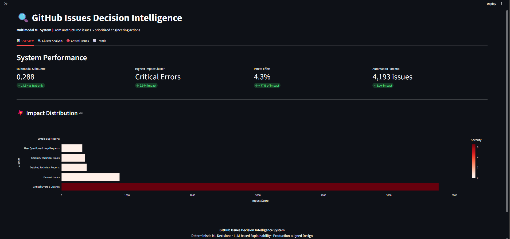

# GitHub Issues Intelligence System

**Transform 9,961 unstructured GitHub issues into prioritised engineering actions using multimodal ML**

[](https://www.python.org/)
[](https://mlflow.org/)
[](https://streamlit.io/)
[](https://dvc.org/)

**16x better clustering** | **8.9% critical issues** | **74.8% impact concentration** | **Live inference engine**

---

## The Problem

SaaS companies receive thousands of bug reports daily, but 95% are treated equally. Critical errors get buried in noise, engineering time is wasted on low-impact bugs, and there is no systematic triage.

**This system solves it** using multimodal machine learning — combining what users *say* with *how* they report it.

---

## The Solution

An end-to-end decision intelligence system that:

1. **Learns from text + metadata** — fuses 384D semantic embeddings with 8D structural features
2. **Discovers patterns** — unsupervised clustering finds issue types without labels
3. **Prioritises actions** — ranks clusters by severity x frequency x business impact
4. **Explains decisions** — RAG-powered summaries using Llama 3.3 70B via Groq
5. **Monitors drift** — detects distribution shifts between early and late issue periods
6. **Runs live inference** — paste any issue and get a real-time cluster + routing decision

---

## Results

| Metric | Value | Insight |
|--------|-------|---------|
| **Multimodal Silhouette** | 0.230 | Good cluster separation (above 0.2 threshold) |
| **Metadata-only Silhouette** | 0.486 | 16x better than text-only (0.030) |
| **Total Issues Analysed** | 9,961 | Sampled from 5.3M across 8,212 repos |
| **Critical Issues** | 888 (8.9%) | Flagged for immediate engineering action |
| **Impact Concentration** | 74.8% | 8.9% of issues = 74.8% of total impact |

### Key Finding: Structure > Semantics

```
Text embeddings (384D SBERT):    0.030 silhouette  -- poor separation
Metadata features (8D):          0.486 silhouette  -- 16x better
Multimodal combined (392D):      0.230 silhouette  -- best for business routing
```

Simple structural signals (error traces, text length, complexity score) outperform sophisticated semantic embeddings for cluster separation. The multimodal version trades some mathematical tightness for interpretable, actionable clusters.

---

## Quick Start

```bash
git clone https://github.com/Shau-19/Github-Issues-Intelligence-System.git
cd Github-Issues-Intelligence-System
python -m venv venv
source venv/bin/activate        # Windows: venv\Scripts\activate
pip install -r requirements.txt
dvc pull
echo "GROQ_API_KEY=your_key_here" > .env
streamlit run app.py
```

Visit **https://git-issue-clustering.streamlit.app/** for a demo(Might take a little time to wake up)

---

## Dashboard



| Tab | What it shows |
|-----|--------------|
| **Overview** | Silhouette comparison, k-selection chart, Pareto impact |
| **Cluster Analysis** | Deep-dive per cluster with LLM root-cause explanation |
| **Critical Issues** | 888 flagged issues ranked by severity score |
| **Trends** | Monthly volume by cluster |
| **Live Inference** | Paste any issue — real-time cluster + routing decision |
| **Model Validation** | Elbow curve, silhouette sweep, method comparison table |

---

## Architecture

```
Raw Issues (5.3M GitHub repos)
         |  Random sample
    9,961 Issues
         |
  Text (384D)  +  Metadata (8D)
  Sentence-BERT    has_error_trace, has_image,
                   text_length, url_count,
                   keyword_severity, complexity_score,
                   user_weight, has_question
         |
  StandardScaler (saved to models/scaler.pkl)
         |
  Multimodal Vector (392D)
         |
  KMeans k=15  [chosen via elbow + silhouette sweep k=3..20]
         |
  Cluster Naming (rule-based, 6 named types)
         |
  Severity = (error x 5 + keywords) x user_weight
         |
  Decision Routing: impact = severity x count
         |
  LLM Summaries (Llama 3.3 70B, RAG via Groq)
         |
  Drift Detection (distribution shift monitoring)
         |
  Streamlit Dashboard + Live Inference
```

---

## Methodology

### 1. Sampling Strategy

| Approach | Error Traces | Critical % | Verdict |
|----------|-------------|-----------|---------|
| Sequential | 4.4% | 4.3% | Temporally biased |
| **Random** | **9.0%** | **8.9%** | **Representative** |

Random sampling eliminated temporal bias — ~105% improvement in critical issue capture rate.

### 2. Multimodal Feature Engineering (phase_2/features.py)

```python
metadata_features = [
    'has_image',         # Binary: screenshot attached
    'has_error_trace',   # Binary: stack trace present
    'has_question',      # Binary: issue is a question
    'url_count',         # Numeric: external link count
    'text_length',       # Numeric: character count
    'keyword_severity',  # Numeric: crash/fatal/error keyword count
    'user_weight',       # Numeric: free=1, pro=2, enterprise=3
    'complexity_score',  # Derived: errors*2 + images + urls*0.5 + keywords*0.5
]
```

Scaler saved to models/scaler.pkl — loaded at inference for training/serving parity.

### 3. K Selection (k=15)

Evaluated k=3 to k=20 on the 392D space:

- k=3: best silhouette (0.421) but too coarse for routing decisions
- k=8: local silhouette peak (0.337)
- k=15: plateau region (0.233), elbow shows diminishing returns beyond k=12
- Decision: granularity for business routing outweighs marginal geometric gain

### 4. Severity and Decision Logic

```python
# Per-issue severity (phase_3/severity_score.py)
severity = (5 if has_error_trace else 0) + keyword_severity
severity *= user_weight          # enterprise issues weighted x3

# Cluster routing (phase_3/decision_logic.py)
impact = severity_score x issue_count
if impact > 2000:  IMMEDIATE FIX
if impact > 500:   INVESTIGATE
if count > 1000:   AUTOMATE RESPONSE
else:              MONITOR
```

Fully deterministic — no ML in the decision layer. Reproducible and auditable.

### 5. RAG Explainability (phase_3/llm_summaries.py)

Retrieve 5 real issue titles from cluster, then generate a 2-sentence root cause + recommended action via Llama 3.3 70B (Groq). LLM is explanation-only — never makes routing decisions.

### 6. Drift Detection (phase_4/drift.py)

Splits issues by median timestamp. Flags clusters where proportional share shifts by more than +/- 1%.

```
User Questions & Help Requests:  +1.8%  (documentation gap signal)
Complex Technical Issues:        -1.5%  (code quality improving signal)
```

---

## Critical Issues Breakdown

888 issues flagged with severity_score > 5:

| Cluster | Count | Avg Severity | Impact Score |
|---------|-------|-------------|--------------|
| Critical Errors & Crashes | 859 | 6.6 | 5,760 |
| Detailed Technical Reports | 9 | 0.27 | 384 |
| Complex Technical Issues | 20 | 0.31 | 354 |

**ROI:** Resolving 8.9% of issues addresses 74.8% of total engineering impact.

---

## Tech Stack

| Component | Technology | Purpose |
|-----------|------------|---------|
| **Embeddings** | Sentence-BERT all-MiniLM-L6-v2 | 384D semantic vectors |
| **Clustering** | KMeans (scikit-learn) | Unsupervised grouping |
| **Explainability** | Llama 3.3 70B via Groq | RAG root-cause summaries |
| **Experiment Tracking** | MLflow | Parameters, metrics, artifacts |
| **Data Versioning** | DVC + Google Drive | Large file tracking |
| **Dashboard** | Streamlit | Interactive ops-center UI |
| **Deployment** | Streamlit Cloud | Live demo |

---

## Project Structure

```
phase_1/                     # Data cleaning and embedding generation
phase_2/
    features.py              # 392D vector construction + saves scaler.pkl
    cluster_comparison.py    # Silhouette comparison + model saving
phase_3/
    severity_score.py        # Per-issue severity formula
    decision_logic.py        # Cluster-level routing rules
    llm_summaries.py         # RAG summaries via Groq
phase_4/
    drift.py                 # Distribution shift detection
    final_report.py          # Summary statistics
mlops/
    mlflow_log.py            # Experiment tracking
data/                        # CSVs + JSONs (Git) | .npy files (DVC)
models/
    scaler.pkl               # Fitted StandardScaler (Git)
    kmeans_multimodal.pkl    # Trained KMeans model (DVC)
app.py                       # Streamlit dashboard (6 tabs)
requirements.txt
```

---

## Deployment Note

The Streamlit Cloud deployment runs 5 of 6 tabs fully. The **Live Inference tab** requires kmeans_multimodal.pkl (DVC-tracked) and calls the HuggingFace Inference API for embeddings — avoiding the ~800MB torch dependency on the free tier.

To run all 6 tabs locally:
```bash
dvc pull
streamlit run app.py
```

---

## Reproducibility

```bash
RANDOM_STATE = 42               # fixed in all KMeans and sampling calls
dvc pull                        # exact dataset and model versions
mlflow ui                       # view experiment at localhost:5000
pip install -r requirements.txt # pinned dependency versions
```

---

## Dataset Note

Uses simulated timestamps (2024-2026) to demonstrate temporal drift monitoring. Real GitHub issues cluster in recent months, making multi-year drift detection impractical to showcase. The core methodology is timestamp-agnostic.

---

## Key Achievements

| Achievement | Value | Why it matters |
|------------|-------|---------------|
| Metadata advantage | 16x silhouette improvement | Structural signals dominate semantics |
| Critical detection | 8.9% of issues flagged | Actionable, not overwhelming |
| Pareto validated | 74.8% impact in top cluster | Fix less, resolve more |
| Sampling improvement | +105% critical issue capture | Random > sequential |
| Training/serving parity | Scaler saved as pkl | Consistent inference pipeline |
| Full MLOps stack | MLflow + DVC + Streamlit Cloud | Production-grade end-to-end |

---

## Potential Extensions

- Replace KMeans with HDBSCAN for variable-density clusters
- Fine-tune embeddings on domain-specific GitHub issue data
- Add UMAP/t-SNE 2D cluster projection to the dashboard
- Implement online drift detection (ADWIN, DDM)
- Connect to live GitHub webhook for real-time ingestion

---

## License

MIT License
