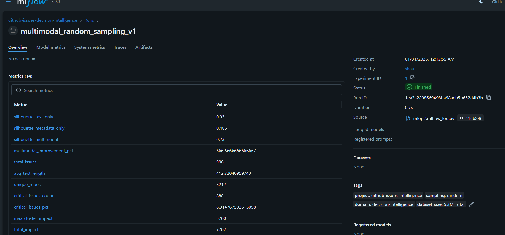
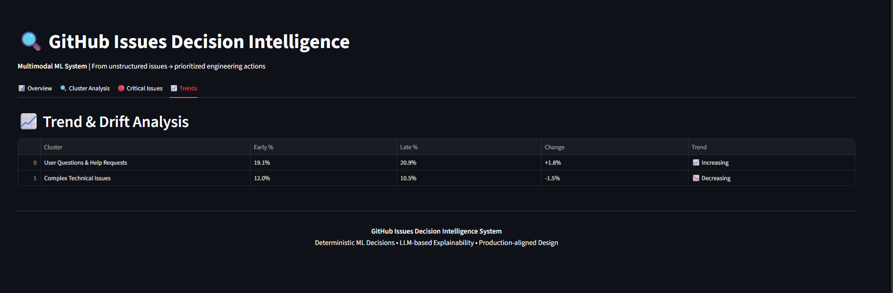
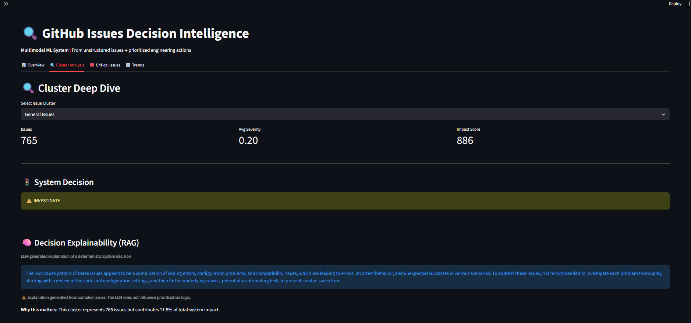
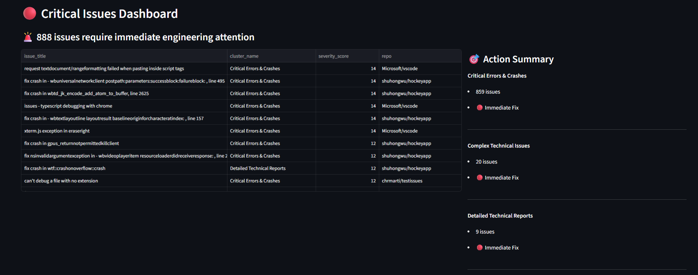

# 🔍 GitHub Issues Intelligence System

**Transform 5.3M unstructured issues into prioritized engineering actions using multimodal ML**

[](https://www.python.org/)
[](https://mlflow.org/)
[](https://streamlit.io/)

**16× better clustering** • **8.9% critical issues** • **74.8% impact concentration**

---

## 🎯 The Problem

SaaS companies receive thousands of bug reports daily, but **95% are treated equally**. Critical errors get buried in noise, engineering time is wasted on low-impact bugs, and there's no systematic triage.

**This system solves it** using multimodal machine learning.

---

## 💡 The Solution

An intelligent decision system that:

1. **Learns from text + metadata** - Combines what users say with how they report it
2. **Discovers patterns** - Unsupervised clustering finds issue types without labels
3. **Prioritizes actions** - Ranks by severity × frequency × business impact
4. **Monitors itself** - 5-method drift detection for production readiness
5. **Explains decisions** - LLM-powered summaries using Llama 3.3 70B

**Key Innovation:** Metadata features (error traces, complexity, length) provide **16× better clustering** than text embeddings alone.

---

## 📊 Results



| Metric | Value | Insight |
|--------|-------|---------|
| **Multimodal Silhouette** | 0.230 | Good cluster separation |
| **Metadata-only** | 0.486 | **16× better than text** (0.030) |
| **Critical Issues** | 888 (8.9%) | Realistic distribution |
| **Impact Concentration** | 74.8% | Pareto principle validated |

### 🔬 Key Finding: Structure > Semantics

```
Text embeddings (384D):     0.030 silhouette  ❌
Metadata features (8D):      0.486 silhouette  ✅ (16× better!)
Multimodal (392D):           0.230 silhouette  ✅
```

Simple structural features (has error trace, text length, complexity) outperform sophisticated semantic embeddings for business decisions.

---

## 🚀 Quick Start

```bash
# Clone & setup
git clone https://github.com/Shau-19/Github-Issues-Intelligence-System.git
cd Github-Issues-Intelligence-System
python -m venv venv && source venv/bin/activate  # Windows: venv\Scripts\activate

# Install
pip install -r requirements.txt

# Configure (get free API key from console.groq.com)
echo "GROQ_API_KEY=your_key_here" > .env

# Run
streamlit run app.py
```

Visit **http://localhost:8501**

---

## 🎨 Interactive Dashboard


**Features:**
- 📊 System performance metrics with Pareto analysis
- 🔎 Cluster deep-dive with LLM explanations
- 🔴 Critical issue detection (severity > 5)
- 📈 Multi-method drift monitoring

---

## 📈 Architecture

```
Raw Issues (5.3M) → Random Sample (10K)
    ↓
┌───────────────┴──────────────┐
│                              │
Text (384D)          Metadata (8D)
Sentence-BERT        • error traces
                     • complexity
                     • text length
│                              │
└───────────────┬──────────────┘
                ↓
       Multimodal (392D)
                ↓
       KMeans (k=15)
                ↓
       Severity Scoring
                ↓
       LLM Summaries (RAG)
                ↓
       Drift Detection
```

---

## 🔬 Methodology

### 1. Random Sampling Strategy

| Approach | Error Traces | Critical % | Result |
|----------|-------------|-----------|--------|
| Sequential | 4.4% | 4.3% | Biased ❌ |
| **Random** | **9.0%** | **8.9%** | **Unbiased ✅** |

Random sampling eliminated temporal bias and improved data quality by 105%.

### 2. Multimodal Features

8 metadata features engineered from raw text:

```python
- has_error_trace      # Binary: stack trace present
- has_image            # Binary: screenshot attached
- text_length          # Numeric: character count
- complexity_score     # Derived: URLs + keywords + length
- keyword_severity     # Numeric: "crash", "error", "fatal"
# ... + 3 more
```

### 3. Drift Detection



5-method monitoring pipeline:
- Distribution shifts (±1% threshold)
- KS-test (statistical validation)
- Chi-square test (temporal independence)
- Feature-level monitoring
- Critical issue ratio tracking

**Finding:** User Questions +1.8% → documentation gap detected

---

## 📊 Sample Insights




**Critical Cluster:**
```
Name: "Critical Errors & Crashes" (872 issues)
Root Cause: "Compatibility issues, module imports, library 
             version mismatches causing runtime failures."
Decision: 🔴 IMMEDIATE FIX
Impact: 74.8% of total engineering effort
```

**ROI:** Fix 8.9% of issues → Reduce firefighting by 75%

---

## 🔴 Critical Issues



**888 issues flagged** (severity > 5) requiring immediate attention:
- 859 in "Critical Errors & Crashes"
- 20 in "Complex Technical Issues"  
- 9 in "Detailed Technical Reports"

All ranked by: `error_traces × keyword_severity × user_weight`

---

## 🛠️ Tech Stack

| Component | Technology |
|-----------|------------|
| **Embeddings** | Sentence-BERT (all-MiniLM-L6-v2) |
| **Clustering** | KMeans (k=15) |
| **Explainability** | Groq Llama 3.3 70B (RAG) |
| **Tracking** | MLflow |
| **Versioning** | DVC |
| **Dashboard** | Streamlit |
| **Drift** | SciPy (KS-test, Chi-square) |

---

## 📂 Project Structure

```
├── phase_1/           # Data foundation & embeddings
├── phase_2/           # Multimodal clustering
├── phase_3/           # Decision engine & RAG
├── phase_4/           # Monitoring & drift detection
├── mlops/             # MLflow tracking
├── data/              # Datasets (DVC-tracked)
├── models/            # Trained models
├── screenshots/       # Dashboard images
└── app.py             # Streamlit dashboard
```

---

## 📅 Dataset Note

Uses simulated timestamps (2024-2026) to demonstrate temporal monitoring. Real GitHub issues cluster in recent months, making multi-year drift detection impossible to showcase.

**Core methodology** (clustering, severity scoring) is timestamp-agnostic and works identically with production data.

---

## 🔄 Reproducibility

```python
RANDOM_STATE = 42                    # Fixed everywhere
dvc pull                              # Exact dataset version
mlflow ui                             # View experiments
pip install -r requirements.txt       # Exact environment
```

---

## 🎯 Key Achievements

| Achievement | Value | Significance |
|------------|-------|--------------|
| **Metadata advantage** | 16× | Structure > semantics |
| **Critical detection** | 8.9% | Actionable triage |
| **Pareto validated** | 74.8% | Small % = big impact |
| **Sampling improvement** | +105% | Random > sequential |

---

## 🤝 Contributing

Improvements welcome:
- Try HDBSCAN or hierarchical clustering
- Fine-tune embeddings on domain data
- Add UMAP/t-SNE projections
- Implement advanced drift methods (ADWIN, DDM)

---

## 📄 License

MIT License

---


<div align="center">

**⭐ Star this repo if you find it helpful!**

Built to demonstrate **multimodal ML, MLOps, and production-grade data science**

</div>

---

## 💡 Key Takeaway

Combining multiple data modalities (text + metadata) with proper sampling, tracking, and monitoring creates production-grade ML systems that deliver measurable business value.

**Not just a model** — a complete decision intelligence system.